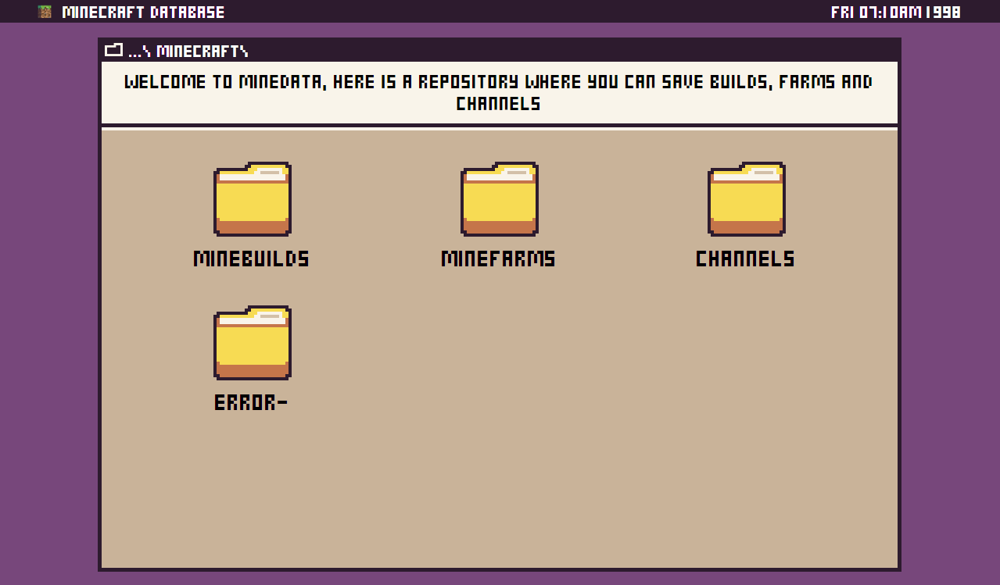
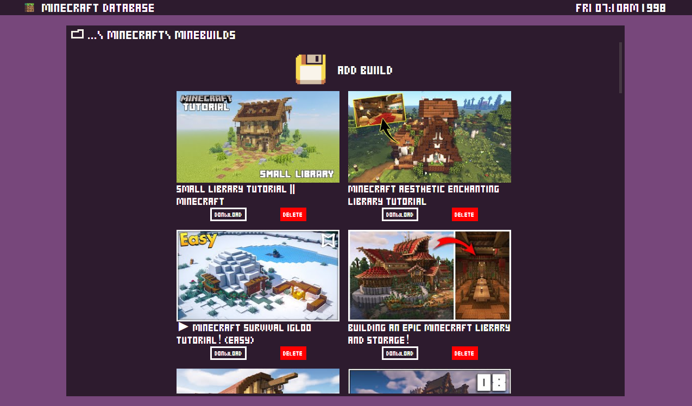
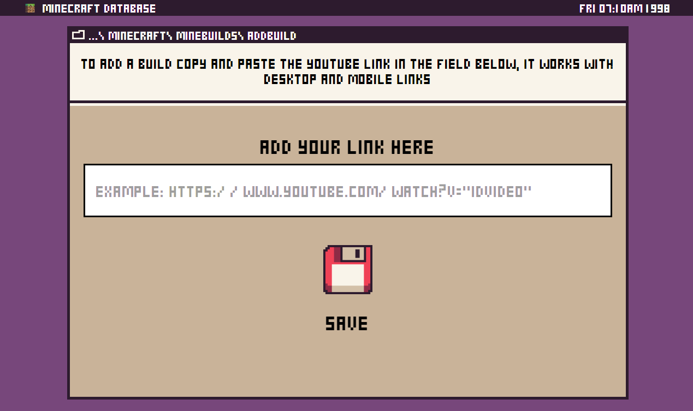
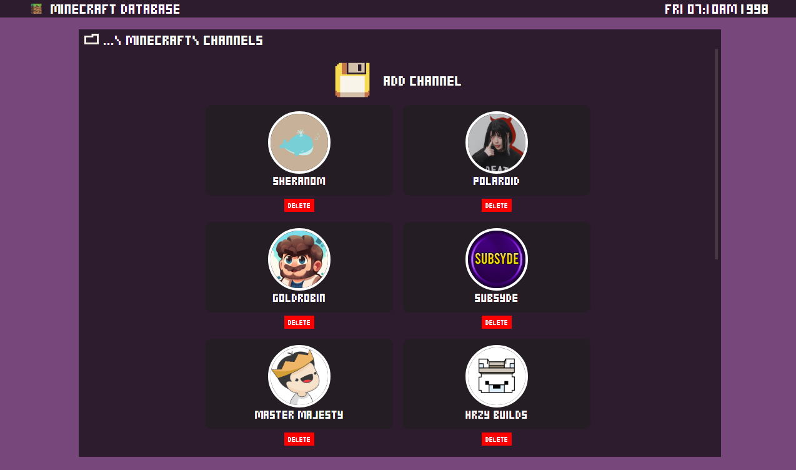

<h2 align="center">
   Minecraft Database
</h2>

<p align="center">
  <a href="#-projeto">Projeto</a>&nbsp;&nbsp;&nbsp;|&nbsp;&nbsp;&nbsp;
  <a href="#-como-rodar-o-projeto">Como rodar o projeto</a>&nbsp;&nbsp;&nbsp;|&nbsp;&nbsp;&nbsp;
  <a href="#-tecnologias">Tecnologias</a>&nbsp;&nbsp;&nbsp;|&nbsp;&nbsp;&nbsp;
  <a href="#-Layout">Layout</a>&nbsp;&nbsp;&nbsp;|&nbsp;&nbsp;&nbsp;
  <a href="#-licença">Licença</a>
</p>

## 💻 Projeto

Este projeto foi uma ideia que tive pra poder organizar links de vídeos de minecraft referente a construções, farms e canais que eu ficava salvando em todo canto do meu pc, o minedata é como se fosse um repositório onde é possível salvar esses links de forma organizada e fácil, ele contém as seguintes funcionalidades:

- [x] Adicionar um novo video
- [x] Adicionar um novo canal
- [x] Remover o video ou canal da lista
- [x] Fazer Download do video correspondente a esse link por meio de um site externo
- [x] Mostrar os links já salvos

Projeto foi hospedado no Heroku. Acesse o **MineData** desenvolvido [clicando aqui](https://minedata-demo.herokuapp.com).

### 📸 Imagens

**HomePage**


**Builds Listadas**



**Adicionar uma nova Build**



**Canais Listados**



## 🧭 Como rodar o projeto

**Clone este repositório**

```bash
git clone https://github.com/vitorsemidio-dev/ignite-todo-list.git
```

**Acesse a pasta**

```bash
cd minedata
```

**Configure os Envs**

```js
// minedata/.env
PORT = 3000
DB_MINEATLAS = "conexão do seu banco"
```
```js
// client/.env.local
REACT_APP_API_URL = http://localhost:3000/

REACT_APP_API_KEY = "sua Api key do youtube" 
```

**Instale as dependências**

```bash
npm run install_all
```

**Execute a aplicação**

```bash
npm run start_dev
```

## 🚀 Tecnologias

Esse projeto foi desenvolvido com as seguintes tecnologias:

- [ReactJS](https://pt-br.reactjs.org)
- [JavaScript](https://www.javascript.com)
- [NodeJs](https://nodejs.org/en/)
- [ExpressJs](https://expressjs.com)
- [MongoDB](https://www.mongodb.com/pt-br)
- [Axios](https://axios-http.com/ptbr/)
- [ReactRouter](https://reactrouter.com)
- [ReactSpinners](https://www.davidhu.io/react-spinners/)
- [TypewriterJS](https://github.com/tameemsafi/typewriterjs#readme)


## 🔖 Layout

Você pode visualizar a imagem de referencia do projeto através [desse link](https://imgur.com/a/tQDr7vy).

## 📝 Licença

Esse projeto está sob a licença MIT. Veja o arquivo [LICENSE](LICENSE) para mais detalhes.